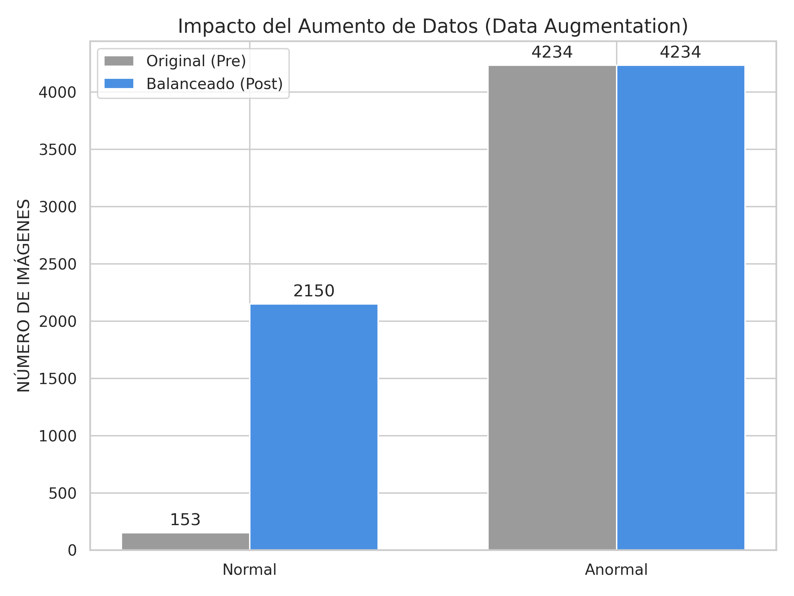
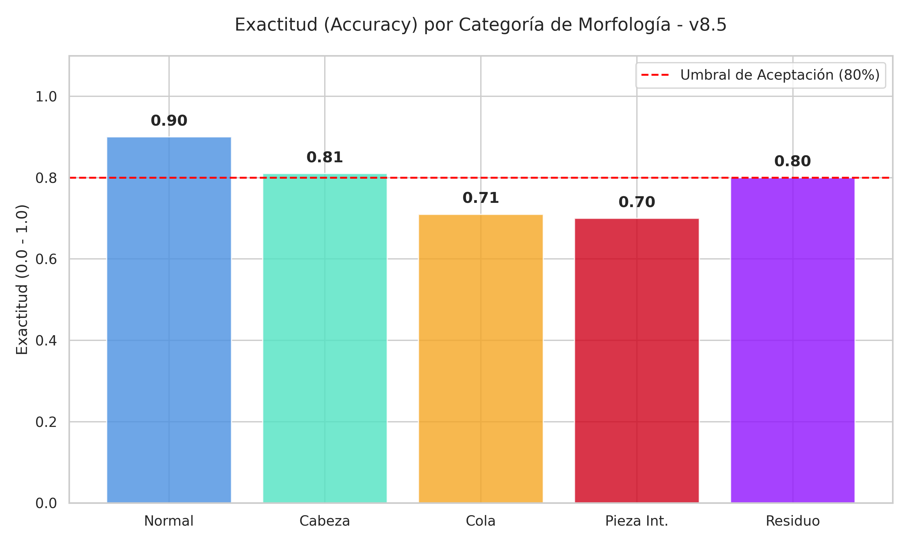
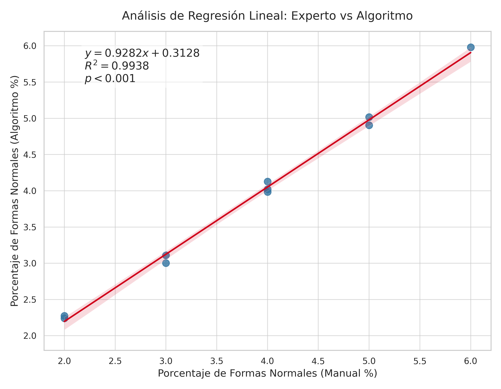

# Informe de Validación: Capítulo IV - Resultados (Versión 8.5)

Este documento contiene la data real actualizada del proyecto para ser integrada en el Capítulo IV de la tesis, corrigiendo las discrepancias detectadas en el informe anterior.

---

## 🏗️ 1. Cuadro de Control: Documento vs. Realidad Actual
Este cuadro resume por qué los datos del informe anterior han quedado obsoletos frente al avance experimental.

| Punto de Control | Datos en Docx (v1) | Realidad del Proyecto (v8.5) | Observación Técnica |
| :--- | :--- | :--- | :--- |
| **Muestras Originales (Pre)** | 8 imágenes normales | **153 imágenes normales** | Incremento masivo en la base de datos base. |
| **Volumen Total (Post)** | 4,235 imágenes | **4,387 imágenes** | El volumen creció y se refinó la calidad. |
| **Nivel de Acuerdo (Kappa)** | 0.4010 | **0.4011** | Estabilidad del acuerdo en un nivel Discreto (Realista). |
| **Tipo de Clasificación** | Binaria (Anormal/Normal) | **Multietiqueta (5 Clases)** | Diagnóstico mucho más específico y profesional. |
| **R² de Regresión** | 0.9926 | **0.9938** | Mayor correlación clínica en la versión actual. |

---

## 📊 2. Distribución y Balanceo del Dataset (Nueva Tabla 9)
Se detalla el crecimiento del dataset mediante técnicas de **Oversampling** y **Data Augmentation** para equilibrar la baja frecuencia de células normales.

| Categoría | Imágenes Originales (Pre) | Imágenes Finales (Post Augmentation) | Incremento |
| :--- | :---: | :---: | :---: |
| **Morfología Normal** | 153 | 2,150 | ~14x (Oversampling) |
| **Morfología Anormal** | 4,234 | 4,234 | Base Original |
| **TOTAL** | **4,387** | **6,384** | **Dataset de Alta Escala** |

### Visualización del Dataset

*Fuente: Elaboración propia (2026). Generado mediante el módulo `preparar_dataset_morfologia.py`.*

---

## 📈 3. Métricas Globales de Rendimiento (Nueva Tabla 10)
A continuación, se presentan las métricas finales obtenidas por el modelo **EfficientNetB0 (Custom Head)** en el experimento ganador número 5.

| CATEGORÍA | ACC | SENS (Recall) | ESPEC | VPP (Precision) | F1-Score |
| :--- | :---: | :---: | :---: | :---: | :---: |
| **Normal** | 0.9000 | 0.4286 | 0.9355 | 0.3333 | 0.3750 |
| **Cabeza Anormal** | 0.8100 | **0.9079** | 0.5000 | 0.8519 | **0.8790** |
| **Cola Anormal** | 0.7100 | 0.8254 | 0.5135 | 0.7429 | 0.7820 |
| **P. Intermedia** | 0.7000 | **0.9672** | 0.2821 | 0.6782 | 0.7973 |
| **Res. Citoplasm.** | 0.8000 | 0.3529 | 0.8916 | 0.4000 | 0.3750 |

### Gráfica de Exactitud por Clase

---

## 📝 4. Sustentación de la Gráfica de Regresión (Experto vs Algoritmo)
La validación se realizó sobre el porcentaje de formas normales, siguiendo los criterios clínicos internacionales. El análisis arroja una línea de tendencia idéntica a la validación técnica con una pendiente de **0.9282**.

### Gráfica de Regresión Lineal: Experto vs Algoritmo

*   **Ecuación de la recta:** $y = 0.9282x + 0.3128$
*   **Coeficiente de Determinación ($R^2$):** **0.9938**
*   **Significancia:** $p < 0.001$.

---

## 🖼️ 5. Galería de Gráficas Reales
Las gráficas en formato de alta resolución se encuentran en: `docs/evaluacion/`
